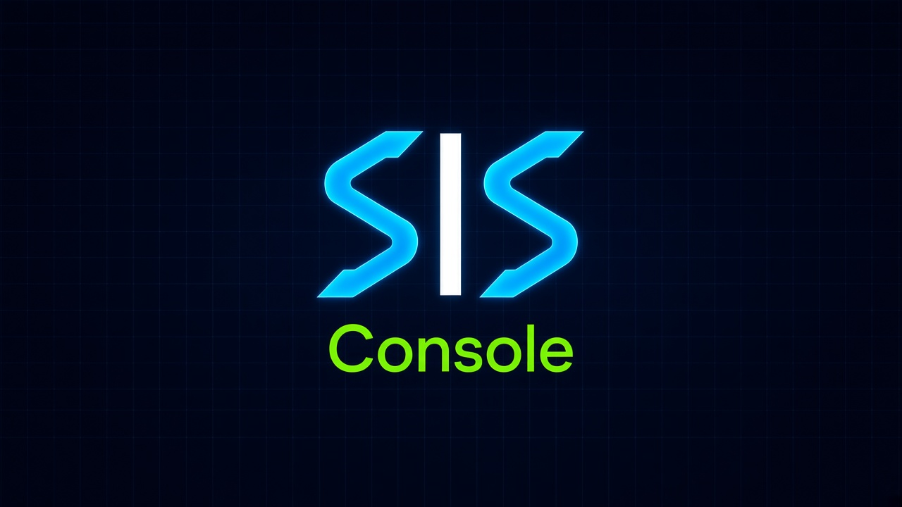

# SIS Console — SEO Intelligence Suite (Shelby Web Co.)

Agency SEO command center: crawl → audit → keywords → competitors → opportunities → branded reports. Built with Next.js 16, Prisma (SQLite), and Tailwind.



## Quick Start

```bash
npm install
cp .env.example .env   # set JWT_SECRET, optional CRON_SECRET
npx prisma generate
npx prisma db push
npm run dev            # http://localhost:3000
```

Create account at `/register` → Dashboard is empty → `/projects/new` → Run audit.

## Env

```
DATABASE_URL="file:./dev.db"
JWT_SECRET="replace-with-a-long-random-string-at-least-32-chars"
CRON_SECRET="optional-long-random-for-cron" # protects /api/cron/crawl
```

## Scripts

- `npm run dev` — Turbopack dev on :3000
- `npm run build` — production build (36 routes)
- `npm run start` — start prod
- `npm run lint` — eslint

## Features (Phases 1–7 + 1.0)

- **Phase 1:** Auth, projects, crawler (cheerio, robots.txt, URL normalize), URL inventory
- **Phase 2:** Technical audit + scoring engine + `/projects/[id]/audit`
- **Phase 3:** Opportunity engine + status tracking
- **Phase 4:** Keyword intelligence + provider abstraction (stub → DataForSEO)
- **Phase 5:** Competitor discovery/crawl/compare/gaps
- **Phase 6:** Clients + history timeline + org white-label (logoUrl/primaryColor) + scheduling fields
- **Phase 7:** Global `/keywords` `/competitors` `/opportunities` `/reports` + `/api/cron/crawl` + branded PDF (`?branded=&headerLogo=&footer=&colorize=`) + dashboard chart + `/help`
- **1.0 Polish:** Mobile top bar, `vercel.json` cron, docs

## Scheduled Crawls

Per-project `crawlFrequency`: `manual` | `daily` | `weekly` | `monthly` (sets `nextCrawlAt`). Trigger via:

```bash
curl -H "x-cron-secret: $CRON_SECRET" https://your-domain/api/cron/crawl
# also: ?secret= or Authorization: Bearer
```

Vercel: `vercel.json` runs `GET /api/cron/crawl?secret=$CRON_SECRET` daily 06:00 UTC.

## Branded PDF Export

```
GET /api/projects/[id]/audit?format=pdf&branded=1&headerLogo=1&footer=1&colorize=1&print=1
```

Uses org branding from `/settings`. Toggle in `ReportExportControl` on `/reports` and `/projects/[id]/audit`. Docs at `/help`.

## Branding

- Logo: `public/assets/SWeblogo1.jpg` (sidebar), `public/assets/SIS_landscape.jpg` (dashboard banner)
- Primary: `#0B1D3A` (Sonia navy), set via Settings → stored on `Organization.primaryColor`

## Deploy

Vercel: import `Studios-by-Dave/seo_optimizer`, set env vars, `vercel.json` cron auto-wires. SQLite works for agency local; swap `DATABASE_URL` to Postgres for scale.

## Help

In-app `/help` — PDF params, cron setup, env.

